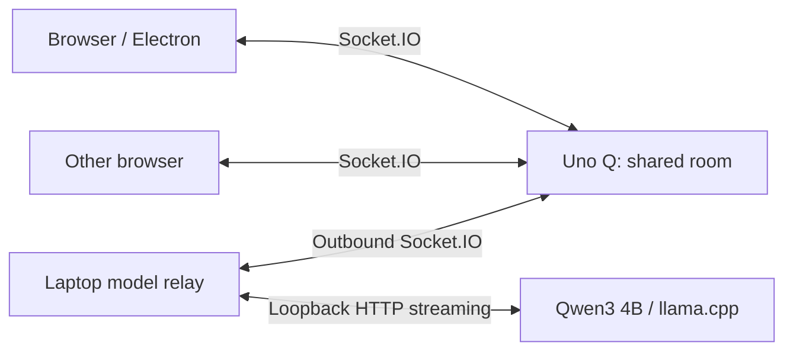

# Openchat

A shared local chat room hosted by an Arduino Uno Q. Everyone connected to TravelQ can open the same conversation in a browser, see other people's cursors, share a message draft, and scroll the conversation together. Qwen3 4B runs on the host laptop.

## Run it

The model and Q app are already installed on this laptop and board.

1. Connect the laptop to **TravelQ**.
2. In this project, run `npm run hub` and keep that terminal open. It starts Qwen3 and the model relay.
3. Open **http://192.168.50.1:7000** in a browser, or run `npm start` for the Electron window.
4. Other devices join TravelQ and open the same URL. They need no model, Node.js, or Electron installation.

While the laptop is on another Wi-Fi network, leave the Q connected by USB. `npm run hub` and `npm start` automatically try ADB forwarding if the TravelQ address is unavailable. On the laptop, use **http://127.0.0.1:7000** in that case; other TravelQ devices still use the Q's address. Restart `npm run hub` after switching between USB and Wi-Fi if you want the relay to use the new path. Closing the hub terminal stops inference; the room on the Q remains available.

`OPENCHAT_URL=http://your-board:7000 npm run hub` overrides board discovery. You can use the same override with `npm start`. Run only one laptop hub instance.

## What is shared

- The Q owns the ordered chat history, the current generation, presence, shared draft, and relative scroll position.
- The first browser to join is labeled room host. If it leaves, the next browser becomes room host. In this version, the laptop running `npm run hub` supplies inference independently of that browser label; a phone becoming room host does not move the model to the phone.
- One reply is generated at a time, with streamed text visible to everyone. Anyone in the room can send the shared draft or stop a reply.
- Draft updates carry a revision. Conflicting stale edits are replaced with the server's current draft; simultaneous editing is not a character-merging collaborative editor.
- Cursors use normalized viewport coordinates and transmit up to 25 times per second. Each browser sees everyone else's cursor, with their generated name and color. Touch-only devices can chat without a continuously visible pointer.
- Scroll position is proportional to each screen's conversation height. Different viewport sizes wrap text differently; the app shares conversation state, not a pixel-for-pixel remote desktop.
- The last 100 messages survive Q app restarts in `/home/arduino/ArduinoApps/openchat/.cache/openchat-history.json`. Draft, presence, and scroll are session state. Interrupted generations are marked as interrupted.

## Model and memory

The model is the official [Qwen3-4B-GGUF Q4_K_M](https://huggingface.co/Qwen/Qwen3-4B-GGUF), pinned to revision `bc640142c66e1fdd12af0bd68f40445458f3869b`. Its download is 2,497,280,256 bytes; SHA-256:

```text
7485fe6f11af29433bc51cab58009521f205840f5b4ae3a32fa7f92e8534fdf5
```

Inference uses [llama.cpp](https://github.com/ggml-org/llama.cpp) v0.4.0, built for this ARM64 Linux laptop. The default settings are CPU inference, four threads, one generation slot, a 2,048-token context, 384 output tokens, and thinking disabled. The model used about 2.5 GB of resident RAM and generated around 15–16 tokens/second in short tests on this machine. Other applications and prompt length affect performance.

The UI retains more history than the model sees. Inference uses the most recent completed messages within a 2,400-character input budget, with a maximum 2,000-character message. Very token-dense inputs can still exceed the model's token context and will produce a visible error. Long replies stop at the output budget. Increasing the context or output budget uses more memory.

## Install or update

Prerequisites on the laptop: Node.js, npm, ADB, Git, curl, CMake, and a C++ compiler. The Q must already have the Openchat Arduino app with the WebUI brick.

```bash
npm ci
npm run setup:model
npm run deploy
npm run hub
```

`setup:model` builds the pinned llama.cpp release with two compiler jobs, resumes the model download, and verifies its checksum. It requires internet access; normal chat does not.

`deploy` copies the room server and browser assets to the existing Q app and restarts it with Arduino App CLI. It creates a private model-host token. It does not edit TravelQ. The generated `.local/` directory contains binaries, model weights, credentials, and logs and is excluded from Git.

For debugging, `npm run model` and `npm run host` start the components separately. The standalone host defaults to the TravelQ address; set `OPENCHAT_URL=http://127.0.0.1:7000` to use an existing ADB forward. `MODEL_URL` and `MODEL_API_KEY` can point the bridge to another compatible local inference server.

## Architecture



The model server binds to laptop loopback and requires an API key. The Q verifies a separate host token before accepting inference output. The shared room itself is open to clients that can reach port 7000; it is intended for trusted TravelQ participants. Chat content stays on these devices. TravelQ continues handling the AP and upstream Wi-Fi.

This version runs the complete model on one laptop. Distributed inference / pooled-compute RPC is future work; the relay does not yet split model layers between machines.

## Verification

`npm test` checks room synchronization, stale drafts, host authentication, cancellation, disconnect recovery, persisted history, cursor validation, and timeouts. The deployed app was also exercised with two browser clients and the real model, including shared typing, streamed answers, remote cursors, scroll synchronization, history after reload, and a 390-pixel mobile viewport.

## Restore the pre-change checkpoint

The original laptop code is saved in Git at `checkpoint/before-ai-hub-20260914` (`9bb07e4`). Verified laptop and Q app backups, including TravelQ, are in:

```text
/home/jerb/openchat-checkpoints/before-ai-hub-20260914/
```

Read `RESTORE.md` there before restoring. The archive is an app/source backup, not a full board image. Save any later work before replacing files.
